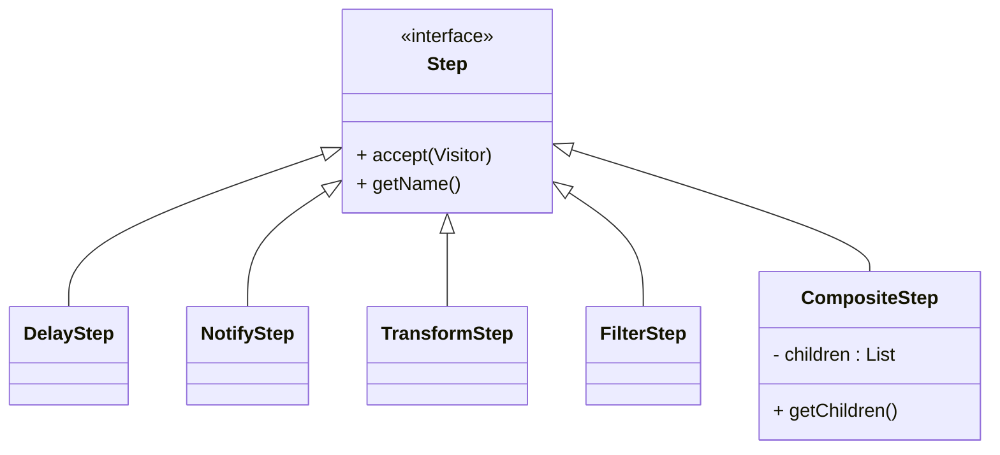
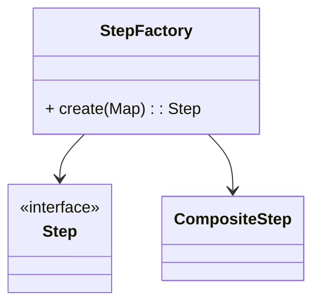
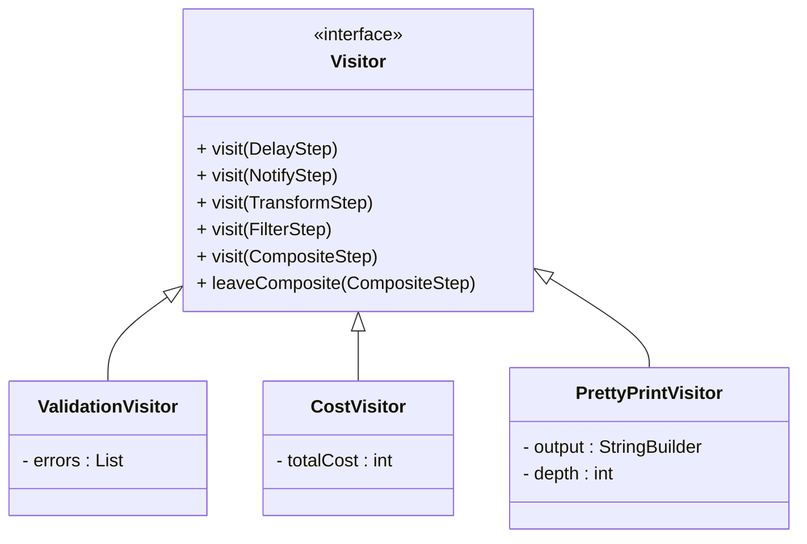
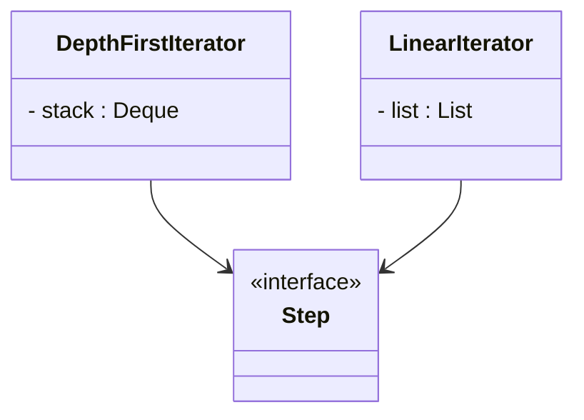
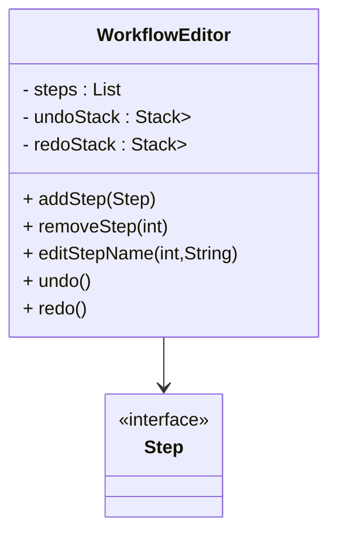
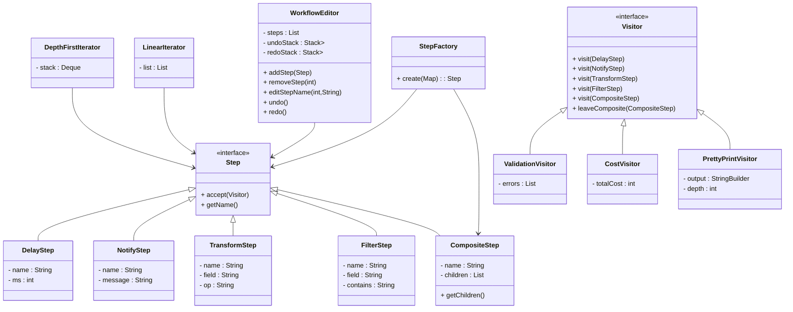

# Workflow Automation System — Assignment 2

This project implements a workflow automation engine using four core object‑oriented design patterns:

- **Factory Pattern** — constructing workflow steps from configuration  
- **Visitor Pattern** — adding operations without modifying step classes  
- **Iterator Pattern** — traversing workflow structures  
- **Memento Pattern** — supporting undo/redo in a workflow editor  

The system supports multiple step types, nested composite workflows, validation, cost estimation, pretty‑printing, and full undo/redo frameworks.

---

## 1. Overview

A workflow is represented as a tree of `Step` objects. Each step performs an action such as:

- Transforming data  
- Filtering data  
- Delaying execution  
- Sending notifications  
- Grouping steps inside a concept referred to as `CompositeStep`

The system reads configuration maps (simulating JSON), constructs the workflow, and allows external operations through visitors and iterators.

---

## 2. Design Decisions

### 2.1 Factory Pattern

The `StepFactory` class constructs concrete step objects based on a `"type"` field in the configuration map.

Key decisions:

- Implemented using a `switch` on lowercase type strings  
- Supports all required step types: `delay`, `notify`, `transform`, `filter`, `composite`  
- Composite creation is **recursive**, enabling nested workflows  
- Throws `IllegalArgumentException` for unknown or missing types  
- Ensures clean separation between configuration parsing and object creation  

---

### 2.2 Visitor Pattern

The Visitor Pattern allows adding new operations without modifying step classes.

Implemented visitors:

- **ValidationVisitor**  
  - Ensures required fields are present  
  - Ensures names are non‑empty  
  - Ensures delay values are positive  
  - Traverses nested composites and accumulates errors  

- **CostVisitor**  
  - Computes deterministic cost:  
    - Transform = 1  
    - Filter = 1  
    - Notify = 2  
    - Delay = ceil(ms / 100)  
  - Composite cost = sum of child costs  

- **PrettyPrintVisitor**  
  - Prints workflow structure with indentation  
  - Uses a depth counter  
  - Supports “shrinking cascade” indentation via `leaveComposite()`  
  - Stores output in a buffer for testing  

Design choices:

- `CompositeStep.accept()` handles traversal  
- Visitors remain stateless except for their accumulated results  
- Adding new visitors requires no changes to existing step classes  

---

### 2.3 Iterator Pattern

Two iterators were implemented:

- **DepthFirstIterator**  
  - Preorder DFS  
  - Uses a stack  
  - Pushes children in reverse order to preserve left‑to‑right traversal  
  - Includes composite nodes in traversal  

- **LinearIterator**  
  - Iterates only top‑level children of a composite  
  - If root is not composite, returns a single‑element iteration  

Design goals:

- Deterministic traversal  
- No recursion  
- Clean separation between traversal logic and step classes  

---

### 2.4 Memento Pattern

The `WorkflowEditor` supports:

- Adding steps  
- Removing steps  
- Editing step names  
- Undo  
- Redo  
- Clearing redo history after new edits  

Design decisions:

- Undo/redo stacks store **deep copies** of the workflow  
- Deep copy implemented manually for each step type  
- Composite steps are recursively cloned  
- Ensures past states are immutable and unaffected by future edits  

---

# Main.java Demonstration Guide

The `Main.java` file serves as a complete demonstration of the workflow automation
system. It loads real JSON workflow definitions, converts them into Java maps,
constructs workflow objects using the Factory Pattern, and then showcases all
major system capabilities using the Visitor, Iterator, and Memento patterns.

This guide explains each part of the demo and what it illustrates.

---

## 1. Loading Workflow Definitions (JSON)

`Main.java` loads multiple workflow examples from: 
```
json src/main/resources/workflows/


Each file is a JSON object describing a workflow using the same structure that the `StepFactory` expects. 

Example 

```json
{
  "name": "LeadProcessing",
  "steps": [
    { "type": "transform", "name": "TrimName", "field": "name", "op": "trim" },
    { "type": "filter", "name": "OnlyGmail", "field": "email", "contains": "@gmail.com" },
    { "type": "delay", "name": "Delay500", "ms": 500 }
  ]
}
```
The demo loads each file, parses it using `org.json`, and converts it into a `Map<String,Object>` using helper methods:

- jsonToMap(JSONObject)

- onToList(JSONArray)

These methods recursively convert JSON objects and arrays into Java maps and lists, making them compatible with the `StepFactory`.

# UML Class Diagram

This diagram summarizes the major classes and relationships in the Workflow Automation System.

---

## 1. Core Model


Notes:
- All concrete steps implement `accept(Visitor v)`
- `CompositeStep` implements recursive traversal

---

## 2. Factory Pattern



Relationships:
- StepFactory → Step (creates)
- StepFactory → CompositeStep (recursive creation)

---

## 3. Visitor Pattern



Relationships:
- Step → Visitor (accept/visit)
- CompositeStep drives traversal by calling visitor on children

---

## 4. Iterator Pattern



Relationships:
- Iterators operate on Step trees
- CompositeStep structure determines traversal order

---

## 5. Memento Pattern


Notes:
- Stores **deep copies** of step lists
- Redo stack clears after new edits

Relationships:
- WorkflowEditor → Step (manages)
- WorkflowEditor → CompositeStep (deep copy recursion)

---

## 6. System-Level Relationships




# Test Suite Summary

This document summarizes all tests included in the project, grouped by category.
Each bullet point lists the test class and a brief description of what it verifies.

---

## 1. Factory Pattern Tests

### **FilterStepFactoryTest**
- Verifies that a `filter` config creates a `FilterStep` with correct name.

### **MissingTypeFactoryTest**
- Ensures missing `"type"` in config throws `IllegalArgumentException`.

### **NestedCompositeFactoryTest**
- Confirms recursive creation of nested `CompositeStep` structures.

### **NotifyStepFactoryTest**
- Verifies that a `notify` config creates a `NotifyStep`.

### **StepFactoryTest**
- Creates a `DelayStep` from config.
- Throws exception for unknown type.
- Creates a `CompositeStep` with multiple children.

### **TransformStepFactoryTest**
- Verifies that a `transform` config creates a `TransformStep`.

---

## 2. Visitor Pattern Tests

### **CostVisitorExactTest**
- Computes exact cost for a workflow containing all step types.

### **CostVisitorTest**
- Ensures total cost is positive for a simple workflow.

### **PrettyPrintIndentationTest**
- Verifies indentation for nested composites in PrettyPrintVisitor.

### **PrettyPrintVisitorTest**
- Ensures PrettyPrintVisitor output contains expected step names.

### **ValidationCompositeTest**
- Confirms ValidationVisitor detects errors inside composite children.

### **ValidationMissingFieldsTest**
- Ensures missing fields in `TransformStep` produce validation errors.

### **ValidationVisitorTest**
- Detects errors in invalid steps.
- Accepts valid steps without errors.

### **VisitorDispatchAllTypesTest**
- Ensures correct visitor dispatch for all step types.

### **VisitorDispatchTest**
- Confirms dispatch for `DelayStep` specifically.

---

## 3. Iterator Pattern Tests

### **DepthFirstIteratorTest**
- Verifies correct DFS traversal order for a multi‑level workflow.

### **DFSIteratorDeepNestingTest**
- Ensures DFS works correctly with deeply nested composites.

### **DFSIteratorMissingElementTest**
- Confirms `next()` throws when iterator is exhausted.

### **LinearIteratorMissingElementTest**
- (Placeholder class; no logic inside.)

### **LinearIteratorSingleRootTest**
- Ensures LinearIterator returns only the root when it is not composite.

### **LinearIteratorTest**
- Verifies correct top‑level traversal order for composite workflows.

---

## 4. Memento Pattern Tests

### **MementoDeepCopyCompositeElementTest**
- Ensures composite steps are deep‑copied in undo snapshots.

### **MementoDeepCopyTest**
- Confirms editing after undo does not mutate previous snapshots.

### **WorkflowEditorOperationsTest**
- Tests add, remove, and edit operations on the workflow editor.

### **WorkflowEditorRedoClearTest**
- Ensures redo history is cleared after a new edit.

### **WorkflowEditorUndoRedoTest**
- Verifies undo restores previous state and redo reapplies it.

### **WorkflowEditorUndoRedoWithCompositeTest**
- Ensures undo/redo works correctly with composite steps.

---

## 5. Integration Tests

### **WorkflowIntegrationTest**
- Builds a workflow from config and verifies:
  - PrettyPrint output
  - CostVisitor correctness
  - ValidationVisitor correctness
  - DFS iterator functionality

### **WorkflowValidationIntegrationTest**
- Ensures invalid workflows produce validation errors end‑to‑end.

### **PrettyPrintAndDFSIntegrationTest**
- Confirms PrettyPrint output contains all names visited by DFS traversal.

---

## Total Tests: **33**

This suite provides full coverage of:
- Factory Pattern  
- Visitor Pattern  
- Iterator Pattern  
- Memento Pattern  
- End‑to‑end workflow behavior  

